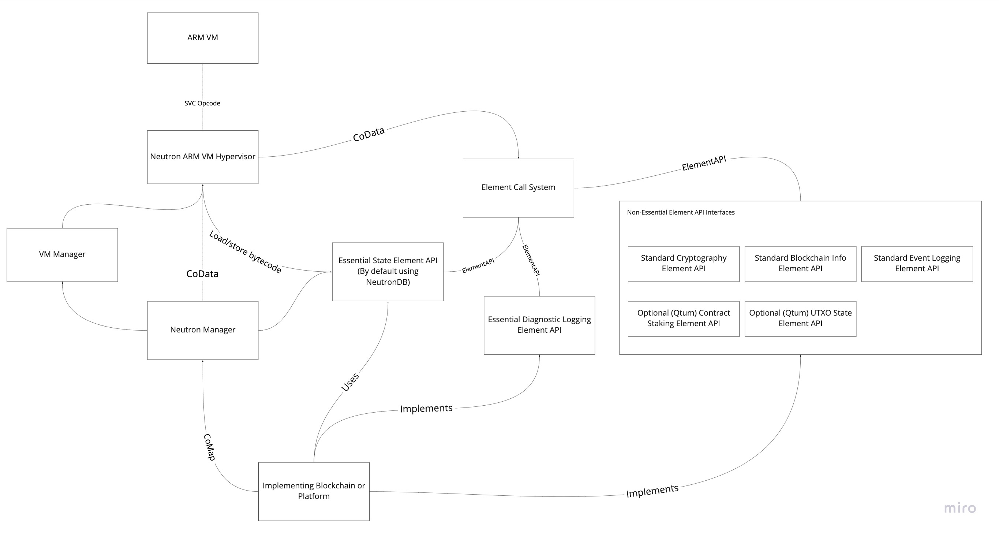

# Spec Overview

## Abstract

Neutron is a new smart contract infrastructure designed as an alternative to the Ethereum Virtual Machine for non-Ethereum based platforms. Neutron is designed to be as minimal as possible at its core, but to be capable of expressing the many different features of a wide variety of blockchains and decentralized platforms. At its most minimal, it is simply a standardized sandboxed environment with execution resource limiting and metering included \(ie, gas limits\). It is designed for exact consistency and security rather than performance. Any standard abiding implementation of Neutron can implement any Neutron program and its course of execution and final result would match any other implementation. This technical specification goes into all details that are "consensus-critical" or would otherwise matter for applications of Neutron where 100% consistency is absolutely required, such as in most blockchain based applications. 

Diagram Link: [https://miro.com/app/board/o9J\_kjJIlZw=/](https://miro.com/app/board/o9J_kjJIlZw=/)

## Terms

* CoStack -- \(Previously known as "SCCS"\) The communication stacks which is used as a data stack which is used to pass data to and from Neutron infrastructure pieces
* CoMap -- The communication maps which are used for communicating with smart contracts
* VM -- Virtual Machine, in this case, the virtual machine which executes smart contract code
* Element -- \(Previously "feature sets"\), an API specifically exposed to smart contracts via the ElementAPI standard. Examples include "BlockchainInfo Element", "UTXO Element", "Crypto Element", etc. Some Elements defined here are to be treated as a standard, meaning that if a blockchain integrating Neutron exposes the element, it must follow the standard laid down here. 
* NeutronABI -- Application Binary Interface, used here specifically to describe a standard method of data layout within the CoMap for communication with other smart contracts
* ElementABI -- Application Binary Interface for communicating with Neutron Elements via the CoStack

## Overall Goals

These are the informal goals of the final Neutron system which is to guide its design.

### Ease of Programming

* Write smart contracts in Rust and other "native" programming languages
* To have allowances for porting Neutron to non-Qtum blockchains \(and even non-blockchain technology\). This includes allowances for "portable" smart contracts which could be deployed to other blockchains on Neutron without needing to recompile or change any code within the smart contract
* To include allowances for a "testbench" environment where smart contracts can be simulated using completely impossible or near impossible blockchain conditions, and in a significantly simpler way than typical regtest network methods
* Implement a state database system with arbitrary length keys and values, to avoid needing to do complex packing and marshaling into a specific word size.
* Initially support the ARM VM, while including allowances for later supporting a WASM VM
* Allow for smart contracts to be upgraded directly, without proxies and other complications 

### Network Security and Resource Minimization

* Implement a state database system with a built-in "black box" unobservable state rent system
* Implement "pre-compile" systems where certain smart contracts can be seamlessly converted from a live VM execution into a static pre-compile execution, without a hardfork
* Allow for smart contract infrastructure to be expanded without affecting previous smart contracts nor with a large cost to exposing such new features.
* Allow for segmented code and data sections within a single smart contract account, meaning that a smart contract could be executed without necessarily needing to load the entire code/data from the account state.
* Allow for novel 2nd layer and zero-knowledge scaling technology
* Include infrastructure flexible enough to adopt unique and novel new VMs into Neutron
* Include standards of interacting with and parsing UTXOs within Qtum and other Bitcoin-based blockchains
* Implement an opt-in "speculative" execution standard used for determining if a smart contract transaction is eligible for being included within a block, similar to Bitcoin Script
* Implement a "simulated" execution mode where fake environments and code can be executed from within a smart contract and the results of such an execution observed

## Non-Goals

These are features or goals that will not be the target of the current specification and potentially not handled by Neutron ever.

* Increasing overall transaction capacity of Qtum or other blockchains \(ie, increase in block size, faster blocks, etc\)
* Second Layer Technology will not be designed specifically as part of Neutron, though it is expected to cover some potential example cases to justify a Neutron feature

## Specification Language

The key words "MUST", "MUST NOT", "REQUIRED", "SHALL", "SHALL NOT", "SHOULD", "SHOULD NOT", "RECOMMENDED",  "MAY", and "OPTIONAL" in this document are to be interpreted as described in [RFC 2119.](https://www.ietf.org/rfc/rfc2119.txt)

